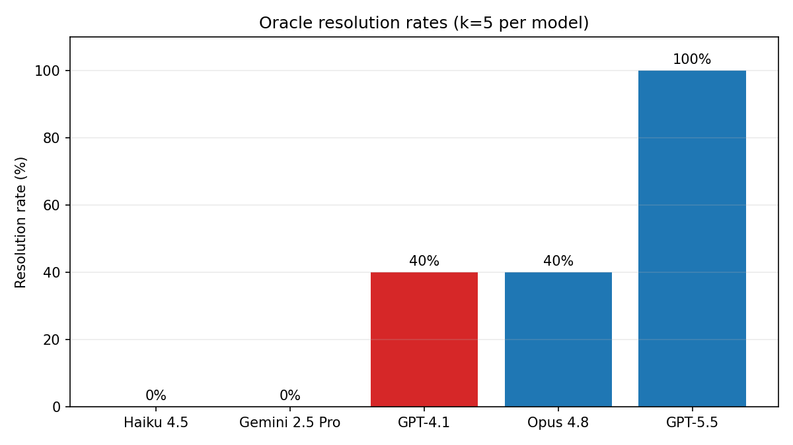

# GordianBench

A **chaos-graded benchmark for agentic distributed-systems debugging** that rejects timing-luck fixes — patches must preserve read-your-writes under a recovering-lag oracle, not just pass a calm-path test.

## Headline finding

On one stale-read bug under identical frozen conditions, **repair mechanism predicts oracle success better than vendor tier**: a mid-tier model (**GPT-4.1**, 40%) tied a frontier model (**Claude Opus 4.8**, 40%), while the other frontier model (**GPT-5.5**) saturated at 100%. Opus's LSN-shaped failures trace to **one WAL-ordering error** — capturing `pg_current_wal_lsn()` inside the writing `UPDATE … RETURNING` (pre-commit watermark) instead of after commit.

## Results

Five cells, k=5 each, oracle-graded under recovering-lag (20s downstream toxic, 10 trials per patch):

| Model | Tier | Resolution |
|-------|------|------------|
| Claude Haiku 4.5 | Mid-tier | 0% (0/5) |
| Gemini 2.5 Pro | Mid-tier | 0% (0/5) |
| **GPT-4.1** | Mid-tier | **40% (2/5)** |
| **Claude Opus 4.8** | Frontier | **40% (2/5)** |
| GPT-5.5 | Frontier | 100% (5/5) |



Canonical numbers: [`archetype-d-stale-read/phase6_cells/phase6_headline_rollup.json`](archetype-d-stale-read/phase6_cells/phase6_headline_rollup.json)

**Full analysis, mechanistic breakdown, and methodology:** [`archetype-d-stale-read/GordianBench_Final_Research_Report.pdf`](archetype-d-stale-read/GordianBench_Final_Research_Report.pdf)

---

## Reproduce

**Requirements:** Python 3.10+, Docker running.

```powershell
python -m venv .venv
.venv\Scripts\activate
pip install -r requirements.txt
```

Set API keys in `.env` for the provider you plan to run (`ANTHROPIC_API_KEY`, `OPENAI_API_KEY`, `GOOGLE_API_KEY`).

### Frozen evaluation config

| Parameter | Value |
|-----------|-------|
| Archetype | `archetype-d-stale-read` (stale-read after replica lag) |
| Chaos | recovering-lag, 20,000 ms downstream toxic |
| Runs per model (k) | 5 |
| Turn budget | 20 |
| build_check | ON (max 2 retries) |
| Oracle | recovering-lag profile, 10 trials per patch |
| Prompt | Shared `SYSTEM` / `USER` in `scripts/run_stale_read_gate.py` |
| Scoring | `oracle_grade.json` only — classifier labels are diagnostic, never headline metrics |

### Run one model cell

```powershell
.venv\Scripts\python.exe scripts\run_phase6_cell.py `
  --provider openai --model gpt-5.5 --k 5 `
  --log-dir archetype-d-stale-read\phase6_cells\gpt-5.5
```

This runs k gate trajectories → oracle-grades each delivered patch → writes `cell_summary.json`.

### Where artifacts land

```
archetype-d-stale-read/phase6_cells/{model}/
  {timestamp}_{provider}/
    trajectory.json       agent run
    model_patch.diff      submitted patch
    meta.json             delivery metadata (patch_bytes, re-applies, build)
    oracle_grade.json     PASS / FAIL verdict (authoritative score)
    patch_pipeline.jsonl  delivery-stage instrumentation
```

Resolution rate = `PASS / scored runs` via [`harness/rollup.py`](harness/rollup.py). Runs with delivery corruption (`patch_reapplies is False`) are excluded from the denominator and flagged for re-run.

### Grade a single run manually

```powershell
.venv\Scripts\python.exe scripts\grade_stale_read_patch.py `
  archetype-d-stale-read\phase6_cells\gpt-5.5\20260630T172240Z_openai `
  --profile lag --lag-ms 20000 --trials 10
```

Writes `oracle_grade.json` in the run directory.

---

**Scope:** This is a result on **one archetype** (stale-read under recovering-lag) with **k=5 per model**; it is **not** a general model ranking.

---

## Repository layout

| Path | Purpose |
|------|---------|
| `agent/` | Agent loop, tools, multi-vendor providers |
| `harness/` | Grading, workspace, patch apply, rollup |
| `scripts/run_phase6_cell.py` | Run one model evaluation cell |
| `scripts/run_stale_read_gate.py` | Single gate trajectory |
| `scripts/grade_stale_read_patch.py` | Oracle-grade one run |
| `archetype-d-stale-read/` | Stale-read topology, evaluation artifacts, final report |
